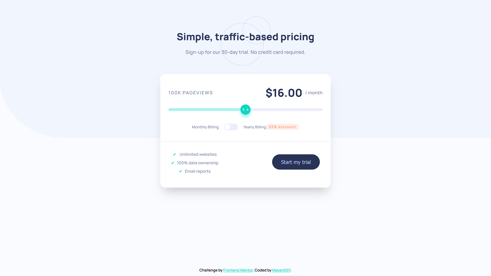

# Frontend Mentor - Interactive Pricing Component Solution

This is a solution to the [Interactive Pricing Component Challenge on Frontend Mentor](https://www.frontendmentor.io/challenges/interactive-pricing-component-t0m8PIyY8). Frontend Mentor challenges help improve coding skills by building realistic projects.

## Table of Contents

- [Overview](#overview)
  - [The Challenge](#the-challenge)
  - [Screenshot](#screenshot)
  - [Links](#links)
- [My Process](#my-process)
  - [Built With](#built-with)
  - [What I Learned](#what-i-learned)
  - [Continued Development](#continued-development)
  - [Useful Resources](#useful-resources)
- [Author](#author)
- [Acknowledgments](#acknowledgments)

## Overview

### The Challenge

Users should be able to:

- View the optimal layout for the component depending on their device's screen size.
- See hover states for all interactive elements on the page.
- Use the slider and toggle to see prices for different page view counts.

### Screenshot



### Links

- Solution URL: [Solution URL](https://github.com/Mayen007/interactive-pricing-component)
- Live Site URL: [live site URL](https://mayen007.github.io/interactive-pricing-component/)

## My Process

### Built With

- Semantic HTML5 markup
- CSS custom properties
- Flexbox
- CSS Grid
- Mobile-first workflow
- Vanilla JavaScript
- [Manrope Font](https://fonts.google.com/specimen/Manrope)

### What I Learned

This project reinforced my understanding of designing responsive and interactive components. Below are some highlights:

#### Using Custom CSS Variables

I defined a set of CSS variables in the `:root` selector to make the design more maintainable and consistent.

```css
:root {
  --soft-cyan: hsl(174, 77%, 80%);
  --strong-cyan: hsl(174, 86%, 45%);
  --white: hsl(0, 0%, 100%);
}
```

#### Styling a Custom Range Slider

I learned to customize the appearance of the slider and its thumb for different browsers:

```css
.price-slider::-webkit-slider-thumb {
  width: 30px;
  height: 30px;
  background: var(--strong-cyan);
  border-radius: 50%;
}
```

### Continued Development

In future projects, I want to focus on:

- Enhancing accessibility (e.g., improving screen reader support).
- Adding animations to improve interactivity.
- Exploring advanced CSS techniques like `clamp()` for better responsive typography.

### Useful Resources

- [MDN Web Docs - Range Input](https://developer.mozilla.org/en-US/docs/Web/HTML/Element/input/range) - Helped with styling and customizing the range slider.
- [CSS Tricks - Responsive Design](https://css-tricks.com/snippets/css/a-guide-to-flexbox/) - Great resource for understanding Flexbox and responsive layouts.

## Author

- Frontend Mentor - [@Mayen007](https://www.frontendmentor.io/profile/mayen007)
- GitHub - [@Mayen007](https://github.com/Mayen007)
